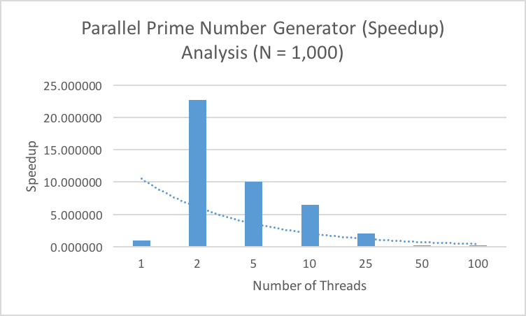
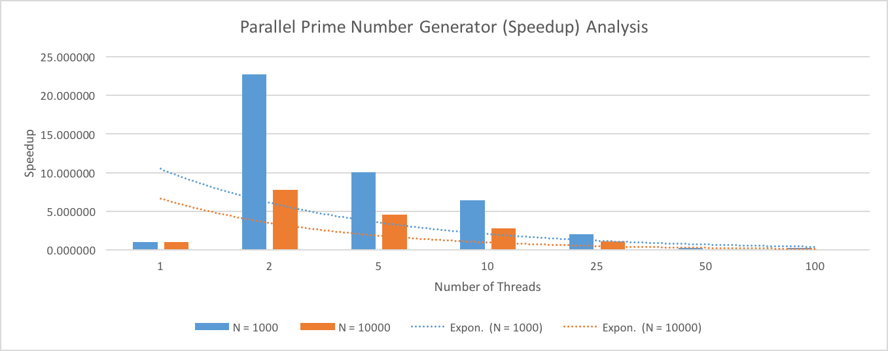
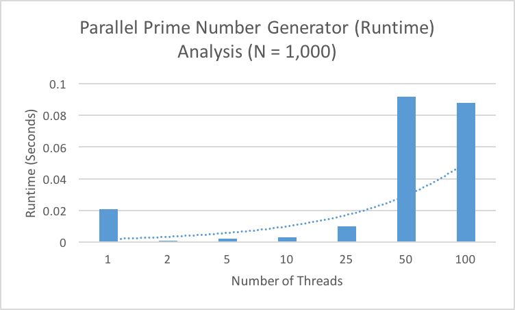
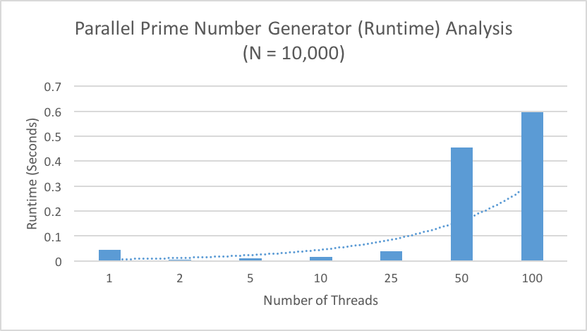
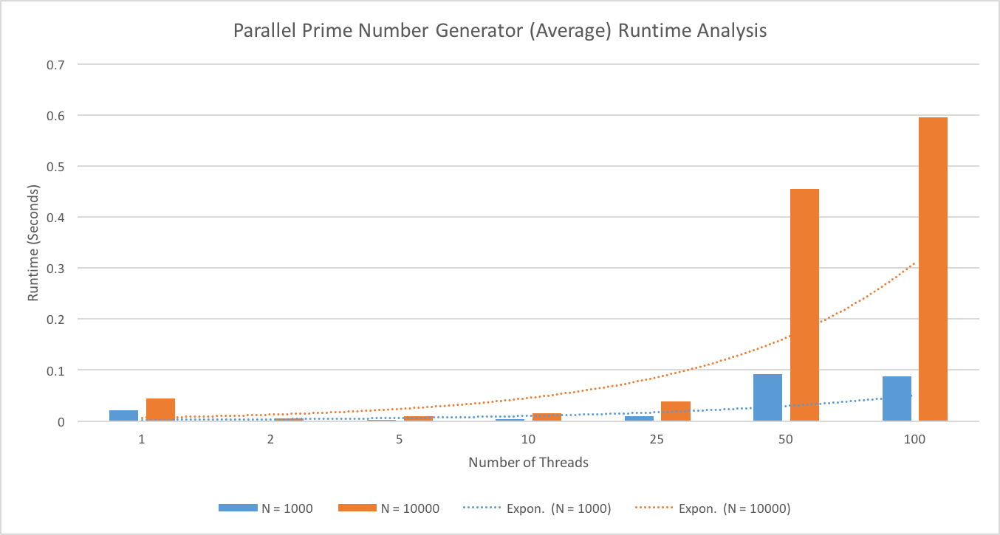
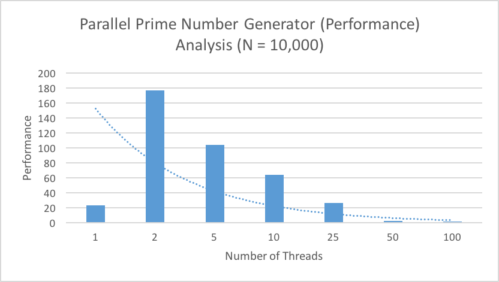
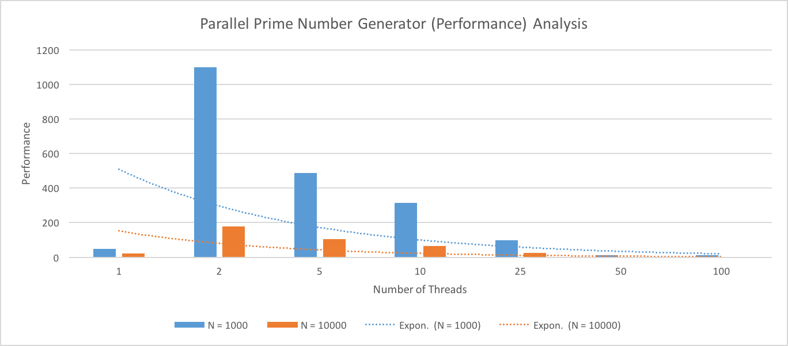

# Project Conclusions

## The graphs
### Speedup
The speedup due to thread count is shown in the graph below:
- For `N = 1,000`

- For `N = 10,000`

- For both speedup graphs combined

Where we define speedup per Dr.Zahran's notes as:

This speedup graph was derived from the averages of the time required to execute fully, 
shown in the graph below, and taken from a sample size of 5 runs per each set, 
with the full data available for viewing [here](Aggregate Output.xlsx).

### Runtime
The original wall-clock runtimes are shown in the following graphs:
- For `N = 1,000`

- For `N = 10,000`

- For both runtime graphs combined

### Performance
We define the performance of an executing program per Dr. Zahran's definition as:

From this definition, the following performance graphs were derived from the full data set linked above:

- For `N = 1,000`

- For `N = 10,000`

- For both performance graphs combined

## The "Why" for the speedup graphs
As we can see per the trendline in the speedup graphs, there is an exponential decrease in 
speedup as the number of threads increases. This could be attributed to the fact that as the
number of threads increase, the amount of work per thread is decreased. Combine this fact with
the performance cost of `fork()`ing and `join()`ing threads, and we can see that overhead 
increases as the number of threads increase.

Another thing to note from the speedup graphs is that as the value of `N` increases, generally 
speaking there is a noticeable decrease in the speedup. This could be attributed to the fact that
since each thread has more data to work on, it requires more time to process during each parallel
section.
